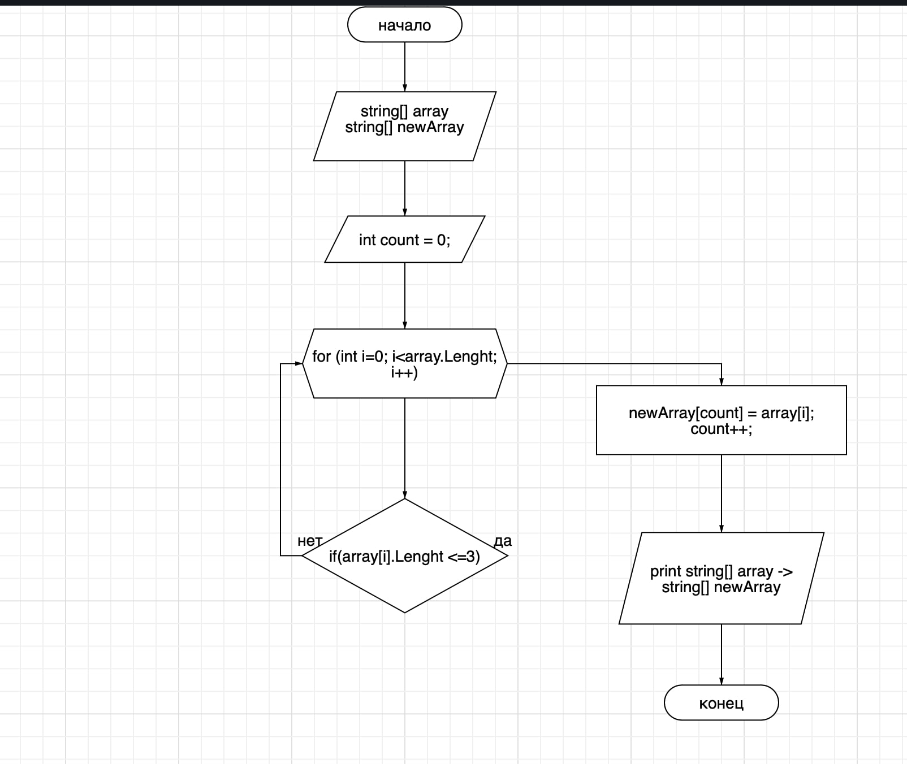

*Задача*: Написать программу, которая из имеющегося массива строк формирует массив из строк, длина которых меньше либо равна 3 символа. Первоначальный массив можно ввести с клавиатуры, либо задать на старте выполнения алгоритма. При решении не рекомендуется пользоваться коллекциями, лучше обойтись исключительно массивами.

*Алгоритм решения*:

1. Мы создаем два массива типа *string*, которые мы называем array и newArray. 
2. Мы создаем метод типа *void* FindWordInArray, где будем использовать цикл for, а также установим счетчик "count = 0".
3. Работая внутри цикла for, мы обозначим "интовую" переменную i равную нулю, также установим, что переменная i меньше длины массива array и будем прибавлять на протяжении цикла к i единицу.

   *"for (i=0; i<array.Lenght; i++)"*

4. Установим условие через if, где будем проверять меньше или равен  array.Lenght трем.

   *"if (array.Lenght <=3)"*

5. Если элемент массива удоввлетворяет это условие, то мы кладем его значение в count массива newArray.
6. После мы увеличиеваем count на 1 и возвращаемся к циклу, где i увеличивается на 1.
Делаем данные повторяющиеся действия до конца длины  массива array.
7. Возвращаем новый заполненный массив.

Программа находится в папке "FinWork"